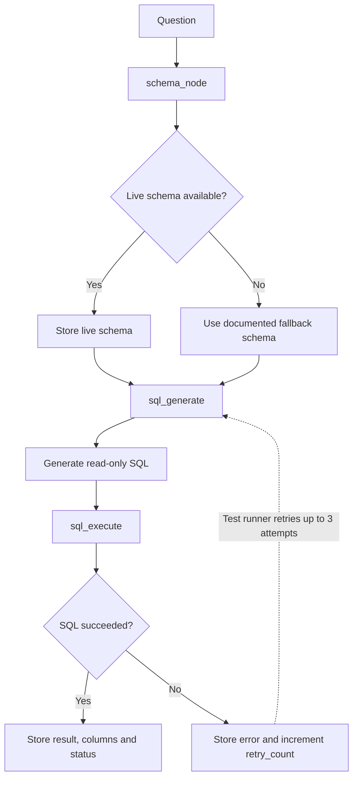
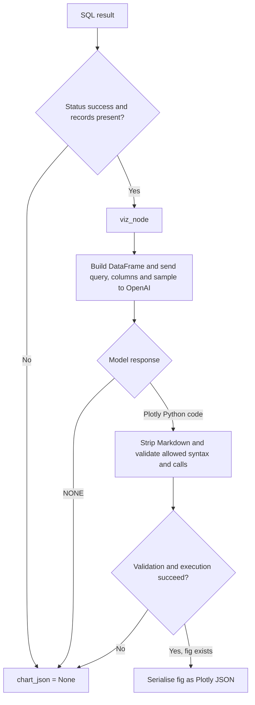

# Enterprise Financial Intelligence Chatbot

## Setup

Install the Python dependencies from `requirements.txt`. Copy [.env.example](.env.example) to `.env` and replace the placeholders with local credentials. Keep `.env` out of version control.

Start the Streamlit application from the repository root with:

```powershell
streamlit run app.py
```

## SQL integration check

The live integration runner is in `tests/sql_integration.py`. Run it from the repository root after installing the dependencies and configuring `.env`:

```powershell
python tests/sql_integration.py
```

This runner sends a request to OpenAI and queries the configured PostgreSQL database. It makes up to three attempts, feeding each SQL execution error into the next generation prompt. Run it deliberately; it is not a routine unit test.

The retry loop currently exists only in this integration runner. Production retries will require a LangGraph conditional edge that routes failed SQL execution back to SQL generation while the retry limit has not been reached.

### SQL agent flow

The SQL nodes are in [src/agents/sql_agent.py](src/agents/sql_agent.py), with connection and query helpers in [src/tools/database.py](src/tools/database.py). The schema node reads table columns from PostgreSQL `information_schema` and falls back to the documented schema if introspection returns no columns. The generation node asks OpenAI for a read-only PostgreSQL query and includes the prior error on retries. The execution node stores the complete result and increments `retry_count` after a failure.



The dotted retry path above is implemented by `tests/sql_integration.py`, not by a compiled production LangGraph graph. The SQL nodes are callable independently; automatic production routing between them is not set up yet.

## Retrieval-augmented generation

The RAG path separates retrieval from answering:

1. [src/tools/rag.py](src/tools/rag.py) embeds the question with OpenAI's `text-embedding-3-small` model and calls the Supabase `match_documents` RPC.
2. The RPC returns matching document rows. Each row should include a `content` field, and its stored embedding dimension must match the embedding model.
3. [src/agents/rag_agent.py](src/agents/rag_agent.py) formats retrieved passages into `rag_context`. Its answer node instructs OpenAI to use only that context and to say when it does not contain enough information.

The current RPC call sends `query_embedding` and `match_count`. Keep these parameter names aligned with the function deployed in Supabase. Do not add `match_threshold` unless the deployed function accepts it; PostgREST rejects arguments that are not in the function signature.

Run the live RAG integration check from the repository root with:

```powershell
python tests/test_rag.py
```

This check calls OpenAI for embeddings and an answer, and calls the Supabase RPC for retrieval. It is a live integration check, not an offline unit test. It checks the retrieval and answer nodes directly; the current Streamlit chat page does not compile or invoke a complete production LangGraph workflow.

The RAG example follows the [Enterprise Chatbot article](https://www.harshaash.com/Python/Enterprise%20Chatbot%20Example/): retrieval embeds the question, fetches related chunks from Supabase, and passes those chunks to an answer node. The implementation in this repository keeps these steps in separate tool and agent modules.

## Visualisation agent

[src/agents/viz_agent.py](src/agents/viz_agent.py) checks that the SQL result has a successful status and non-empty records. It passes those records and the original user question to [src/tools/viz.py](src/tools/viz.py). The helper gives OpenAI a short data sample and asks whether a chart is useful. `NONE`, missing data, invalid generated code, or a generation/execution error all result in `chart_json` being `None`. A valid Plotly figure is returned as JSON for the UI to render.



Generated chart code executes in-process after AST validation, with built-ins disabled and only the provided dataframe and chart libraries in scope. This reduces the allowed surface but is not a general-purpose security sandbox. Keep generated chart code restricted to simple Plotly operations, and do not treat the current helper as safe for arbitrary code execution.

Run the manual visualisation integration check with sample SQL rows from the repository root:

```powershell
python tests/test_viz.py
```

The check calls OpenAI to generate code, so it requires a valid `OPENAI_API_KEY` and is not an offline unit test.

## External news search

The external-search path uses [src/agents/news_agent.py](src/agents/news_agent.py) and [src/tools/search.py](src/tools/search.py). The news node sends the user's query to Serper's Google Search API, serialises the returned JSON into `external_context`, and limits that context to 5,000 characters. If the search or result conversion fails, the node returns an empty context so the workflow can continue without news data.

`src/config.py` loads `SERPER_API_KEY` from the environment or local `.env` into `AppConfig.serper_api_key`. It is a required setting, like the other configured credentials. The variable is included in [.env.example](.env.example); provide your own Serper API key locally and never commit it.

Run the live Serper integration check from the repository root with:

```powershell
python tests/test_news.py
```

This check makes a request to Serper and requires a valid `SERPER_API_KEY` and network access. It is a manual integration check, not an offline unit test. Search results are time-sensitive external evidence; check dates and source links before relying on them.