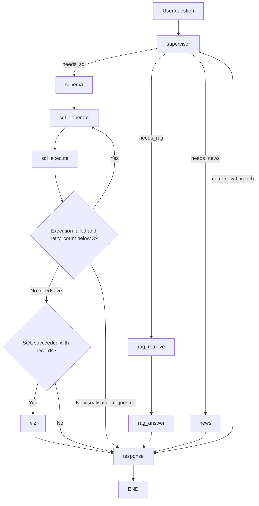
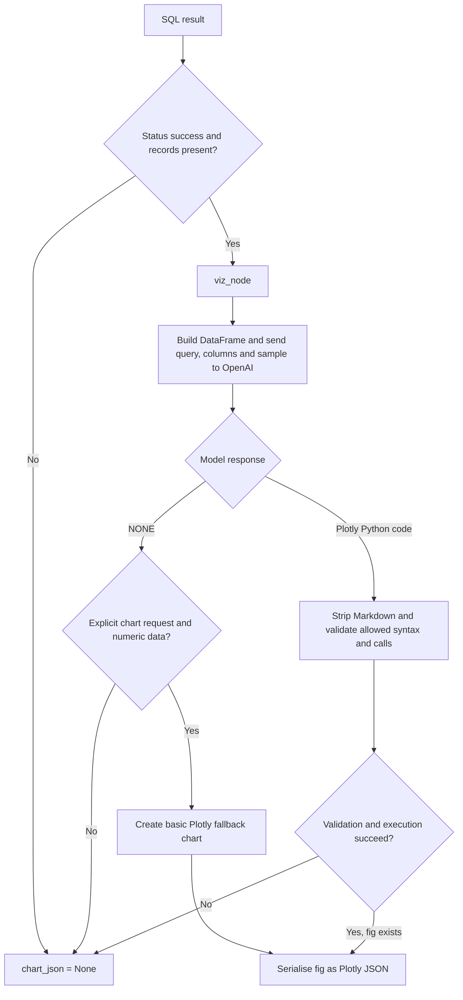

# Enterprise Financial Intelligence Chatbot

## Setup

Install the Python dependencies from `requirements.txt`. Copy [.env.example](.env.example) to `.env` and replace the placeholders with local credentials. Keep `.env` out of version control.

Start the Streamlit application from the repository root with:

```powershell
streamlit run app.py
```

## Agent workflow

[src/graph.py](src/graph.py) compiles the production LangGraph workflow with in-memory checkpointing. The supervisor can start SQL, RAG, and news branches in parallel. These branches converge at response synthesis. Visualisation runs after SQL only when requested and when SQL execution reaches its success/terminal route.



### SQL agent flow and retries

The SQL nodes are in [src/agents/sql_agent.py](src/agents/sql_agent.py), with connection and query helpers in [src/tools/database.py](src/tools/database.py). The schema node reads table columns from PostgreSQL `information_schema` and falls back to the documented schema if introspection returns no columns. The generation prompt asks OpenAI for a read-only PostgreSQL query and includes the previous execution error on each retry. The execution node stores the complete result and increments `retry_count` after a failure.

SQL generation is prompted to return read-only queries, and the executor also uses a PostgreSQL read-only transaction. Configure `DB_USER` as a least-privilege PostgreSQL role with read-only access to the required tables as an additional control. Do not rely on model instructions alone to protect database writes.

Before executing SQL, [src/tools/database.py](src/tools/database.py) cleans the query and calls [src/tools/guardrails.py](src/tools/guardrails.py) before opening a database connection. The guardrail removes comments before checking the query, rejects statement chaining, requires a `SELECT` or `WITH` prefix, and blocks listed mutating keywords. Invalid SQL returns an error status without connecting to PostgreSQL. Valid SQL runs in a PostgreSQL read-only transaction. The lexical check is not a complete PostgreSQL parser, so retain least-privilege database permissions as a separate control.

Run the guardrail checks from the repository root with `python tests/test_guardrails.py`. The script verifies allowed and rejected query forms and mocks the engine to confirm rejected SQL does not open a connection. The project dependencies and required `.env` configuration must still be present because the database module loads its application configuration on import.

Production graph retries are implemented: after a failed execution, [src/graph.py](src/graph.py) routes back to `sql_generate` while `retry_count < 3`. Since the count increments on each failure and starts at zero, this permits at most three SQL executions total. On the final failure, the graph continues to response synthesis. The response node now reports the SQL failure context instead of silently omitting it. The graph does not retry supervisor, OpenAI, Supabase, or Serper failures through this SQL retry edge.

The standalone SQL integration runner in [tests/sql_integration.py](tests/sql_integration.py) also has its own three-attempt loop and calls the SQL nodes directly. Run it from the repository root after installing dependencies and configuring `.env`:

```powershell
python tests/sql_integration.py
```

This live check calls OpenAI and PostgreSQL; run it deliberately, not as routine unit-test collection.

### End-to-end graph check

Run the manually guarded graph integration check from the repository root:

```powershell
python tests/test_graph.py
```

It invokes OpenAI, PostgreSQL, and whichever of Supabase or Serper the supervisor selects. It may also request chart generation. This is a live integration check and may incur API usage; it is not an offline unit test.

The password-gated [app.py](app.py) invokes the compiled graph and renders returned Plotly JSON as an interactive chart. Each Streamlit session keeps its own LangGraph `thread_id`; clearing the chat starts a fresh thread.

For an in-app explanation of the system, use the **Project overview** button above Chat controls in the Streamlit sidebar. It describes the project, agents, graph flow, security controls, setup and integration checks. The overview includes Mermaid diagrams and links to the [reference article](https://www.harshaash.com/Python/Enterprise%20Chatbot%20Example/).

## Retrieval-augmented generation

The RAG path separates retrieval from answering:

1. [src/tools/rag.py](src/tools/rag.py) embeds the question with OpenAI's `text-embedding-3-small` model and calls the Supabase `match_documents` RPC.
2. The RPC returns matching document rows. Each row should include a `content` field, and its stored embedding dimension must match the embedding model.
3. [src/agents/rag_agent.py](src/agents/rag_agent.py) formats retrieved passages into `rag_context`. Its answer node instructs OpenAI to use only that context and to say when it does not contain enough information.

The current RPC call sends `query_embedding` and `match_count`. Keep these parameter names aligned with the function deployed in Supabase. Do not add `match_threshold` unless the deployed function accepts it; PostgREST rejects arguments that are not in the function signature.

Run the live RAG integration check from the repository root with:

```powershell
python tests/test_rag.py
```

This check calls OpenAI for embeddings and an answer, and calls the Supabase RPC for retrieval. It is a live integration check, not an offline unit test. It checks the retrieval and answer nodes directly.

The RAG example follows the [Enterprise Chatbot article](https://www.harshaash.com/Python/Enterprise%20Chatbot%20Example/): retrieval embeds the question, fetches related chunks from Supabase, and passes those chunks to an answer node. The implementation in this repository keeps these steps in separate tool and agent modules.

## Visualisation agent

[src/agents/viz_agent.py](src/agents/viz_agent.py) checks that the SQL result has a successful status and non-empty records. It passes those records and the original user question to [src/tools/viz.py](src/tools/viz.py). The helper gives OpenAI a short data sample and asks for a Plotly chart. If the user explicitly requested a visual and the model returns `NONE`, the helper creates a basic chart from available numeric data, including a single-record bar chart. Without an explicit chart request, or without numeric data, it returns `None`. Invalid generated code or a generation/execution error also returns `None`. A valid Plotly figure is returned as JSON for the UI to render.

This is one visualisation branch with a graph node and a helper, not a separate multi-agent graph: `viz_node()` validates SQL output and delegates to `generate_and_run_chart_code()`. The helper returns Plotly JSON; [app.py](app.py) renders it. The generated-code allowlist reduces the available operations but is not a general-purpose sandbox.



Generated chart code executes in-process after AST validation, with built-ins disabled and only the provided dataframe and chart libraries in scope. This reduces the allowed surface but is not a general-purpose security sandbox. Keep generated chart code restricted to simple Plotly operations, and do not treat the current helper as safe for arbitrary code execution.

Run the manual visualisation integration check with sample SQL rows from the repository root:

```powershell
python tests/test_viz.py
```

The check calls OpenAI to generate code, so it requires a valid `OPENAI_API_KEY` and is not an offline unit test.

## External news search

The external-search path uses [src/agents/news_agent.py](src/agents/news_agent.py) and [src/tools/search.py](src/tools/search.py). The news node sends the user's query to Serper's Google Search API, serialises the returned JSON into `external_context`, and limits that context to 5,000 characters. If the search or result conversion fails, the node returns an empty context so the workflow can continue without news data.

`src/config.py` loads `SERPER_API_KEY` from the environment or local `.env` into `AppConfig.serper_api_key`. It is a required setting, like the other configured credentials. The variable is included in [.env.example](.env.example); provide your own Serper API key locally and never commit it.

Run the live Serper integration check from the repository root with:

```powershell
python tests/test_news.py
```

This check makes a request to Serper and requires a valid `SERPER_API_KEY` and network access. It is a manual integration check, not an offline unit test. Search results are time-sensitive external evidence; check dates and source links before relying on them.