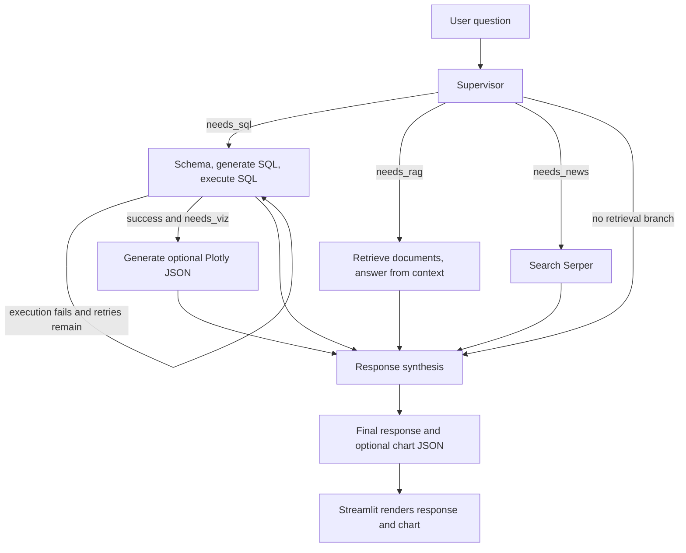

# Enterprise Financial Intelligence Chatbot

## GitHub Copilot prompts and build milestones

This playbook guides students through the current Streamlit and LangGraph financial chatbot in this repository. Run the prompts in order and review each change before moving to the next milestone. The prompts are intended to build the project shown in the repository tree below. Some checkpoints run live integrations and require working credentials and network access.

The application can route a question to PostgreSQL financial data, internal Supabase vector search, and Serper web search. It synthesises available evidence and can return Plotly chart JSON for Streamlit to display. SQL is guarded before execution and runs in a PostgreSQL read-only transaction.

## Current project structure

```text
enterprise-financial-agent/
├── .github/
│   ├── agents/financial-orchestrator.agent.md
│   ├── hooks/
│   │   ├── hooks.json
│   │   ├── log-agent-error.cjs
│   │   └── validate-sql-format.cjs
│   ├── skills/supabase-query-debugger/SKILL.md
│   └── copilot-instructions.md
├── .vscode/mcp.json
├── pages/1_Project_Overview.py
├── src/
│   ├── agents/
│   │   ├── news_agent.py
│   │   ├── rag_agent.py
│   │   ├── response_agent.py
│   │   ├── sql_agent.py
│   │   ├── supervisor.py
│   │   └── viz_agent.py
│   ├── tools/
│   │   ├── database.py
│   │   ├── guardrails.py
│   │   ├── rag.py
│   │   ├── search.py
│   │   └── viz.py
│   ├── config.py
│   ├── graph.py
│   └── state.py
├── tests/
│   ├── sql_integration.py
│   ├── test_graph.py
│   ├── test_guardrails.py
│   ├── test_news.py
│   ├── test_rag.py
│   └── test_viz.py
├── app.py
├── requirements.txt
├── README.md
└── .env.example
```

Keep the real `.env` file local and untracked. Copy `.env.example` to `.env` and fill in credentials locally. Never put real credentials in prompts, source, tests, screenshots, or commits.

## System flow



## Class 1: Workspace and configuration

### 1.1 Dependencies and credential handling

> **Copilot prompt**
>
> Review the existing `requirements.txt` and keep it aligned with the current application. It must include Streamlit, LangGraph, OpenAI, Supabase, SQLAlchemy, psycopg2-binary, pandas, Plotly, python-dotenv, and requests. Do not duplicate packages. Keep secrets out of this file.

> **Copilot prompt**
>
> Create or update `.env.example` with placeholder entries for `SUPABASE_URL`, `SUPABASE_KEY`, `OPENAI_API_KEY`, `SERPER_API_KEY`, `DB_USER`, `DB_HOST`, `DB_PORT`, `DB_NAME`, and `DB_PASSWORD`. Add a comment telling users to copy the template to a local `.env`. Do not read or print the real `.env` contents.

### 1.2 Configuration loader

> **Copilot prompt**
>
> Implement `src/config.py` with a frozen `AppConfig` dataclass and `load_config()`. Use python-dotenv to load a local `.env` without overriding existing environment variables. Require the Supabase, OpenAI, Serper, and PostgreSQL settings listed in `.env.example`; validate that `SUPABASE_URL` is HTTP or HTTPS and that `DB_PORT` is from 1 to 65535. Hide secret fields from the dataclass representation and raise a descriptive `ValueError` listing missing setting names only. Never print secret values.

### 1.3 Copilot workspace guidance

> **Copilot prompt**
>
> Create `.github/copilot-instructions.md` with Python modularity, type hints, PEP 8, British English writing style, and secret-handling guidance. Include the project's LangGraph node boundaries, live integration commands, SQL retry behaviour, RAG RPC signature, visualisation code-safety warning, and database read-only policy. Keep these instructions aligned with the actual source files.

### 1.4 Agent customisation, skills and hooks

> **Copilot prompt**
>
> Add the financial orchestrator profile at `.github/agents/financial-orchestrator.agent.md`, the Supabase query debugging skill at `.github/skills/supabase-query-debugger/SKILL.md`, and the configured hooks under `.github/hooks/`. Check the existing files before editing and preserve their working configuration. Do not claim a hook validates or blocks generated SQL unless the hook actually does so; the authoritative SQL guardrail is `validate_sql_query()` in `src/tools/guardrails.py`.

> **Copilot prompt**
>
> Review `.vscode/mcp.json` for the existing Supabase MCP configuration. Do not add credentials directly to the file. If a server requires authentication, use its supported secure connection mechanism and explain setup without exposing tokens.

### Git checkpoint 1

```bash
git add .github/ .vscode/ requirements.txt .env.example .gitignore src/config.py
git commit -m "chore: configure chatbot workspace and environment"
```

## Class 2: Shared graph state and database tools

### 2.1 Typed graph state

> **Copilot prompt**
>
> Create `src/state.py` with `AgentState(TypedDict)`. Include `user_query`, `chat_history`, `routing_decision`, `schema`, `sql_query`, `sql_result`, `retrieved_docs`, `rag_context`, `rag_answer`, `external_context`, `chart_json`, `final_response`, `retry_count`, and `error`. Type `routing_decision` as a mapping of string flags to booleans. Use `Any` only where the result has a genuinely dynamic external shape. Make initial graph state and tests supply the fields required by the TypedDict.

### 2.2 SQL and Supabase clients

> **Copilot prompt**
>
> Create or update `src/tools/database.py`. Load credentials with `load_config()` and create the SQLAlchemy PostgreSQL engine using SQLAlchemy's URL builder so passwords are correctly escaped. Initialise the Supabase client and the shared OpenAI chat client. Define a documented fallback schema for `companies`, `stock_prices`, `annual_financials`, and `quarterly_financials`, but use live PostgreSQL metadata in `schema_node()` when available. Do not assume company identifier column names when the live schema can be inspected.

### 2.3 SQL cleaning, validation and execution

> **Copilot prompt**
>
> Implement `clean_sql_query(raw_query: str) -> str` and `run_sql(sql: str) -> dict[str, Any]` in `src/tools/database.py`. `run_sql()` must clean the SQL, call `validate_sql_query()` before creating a database connection, and return a guardrail error immediately for invalid input. For valid input, open a SQLAlchemy transaction, set it to PostgreSQL read-only mode before executing the query, and return a consistent status, data, columns, and raw query. Catch SQLAlchemy execution errors and preserve a useful error string. Do not log credentials or query results containing sensitive data.

### 2.4 Deterministic SQL guardrails

> **Copilot prompt**
>
> Implement `validate_sql_query(query: str) -> tuple[bool, str | None]` in `src/tools/guardrails.py`. Ignore SQL comments and quoted values while checking tokens. Permit only one statement starting with `SELECT` or `WITH`; reject statement chaining and forbidden mutation or DDL keywords such as `INSERT`, `UPDATE`, `DELETE`, `DROP`, `ALTER`, `TRUNCATE`, `CREATE`, `REPLACE`, `GRANT`, `REVOKE`, `EXEC`, `EXECUTE`, and `LOCK`. Return a policy explanation for rejected input. Keep this validator on the `run_sql()` execution path. Treat it as defence in depth, not a replacement for read-only database permissions or a full SQL parser.

### Git checkpoint 2

```bash
git add src/state.py src/tools/database.py src/tools/guardrails.py
git commit -m "feat: add typed state and guarded database tools"
```

## Class 3: SQL agent

### 3.1 Schema and query nodes

> **Copilot prompt**
>
> Create or update `src/agents/sql_agent.py` with `schema_node(state: AgentState)`, `sql_generate(state: AgentState)`, and `sql_execute(state: AgentState)`. `schema_node` should read allowed table columns through `run_sql()` from PostgreSQL `information_schema` and use `DATABASE_SCHEMA` only as a documented fallback. `sql_generate` should use the configured OpenAI client, the current schema, and the user's question. Require one read-only SELECT query, no chained statements, and no mutation or schema commands. If `retry_count > 0`, include the previous SQL error in the prompt. `sql_execute` must delegate execution to `run_sql()`, store the complete result, increment `retry_count` only on failure, and preserve the error for retries and final synthesis.

The application executes schema introspection with `run_sql()`, so confirm that the configured read-only PostgreSQL role can read the relevant `information_schema` rows.

### 3.2 SQL node integration check

The direct SQL runner lives in `tests/sql_integration.py`. It exercises the SQL nodes with a three-attempt loop. It calls OpenAI and PostgreSQL, so it is a manual live integration check, not a unit test.

```powershell
python tests/sql_integration.py
```

### Git checkpoint 3

```bash
git add src/agents/sql_agent.py tests/sql_integration.py
git commit -m "feat: add schema-aware sql agent with bounded retry test"
```

## Class 4: Supabase document RAG

### 4.1 Vector search helper

> **Copilot prompt**
>
> Implement `vector_search(query: str, top_k: int = 5) -> list[dict[str, Any]]` in `src/tools/rag.py`. Validate that the query is not blank and that `top_k` is positive. Create a query embedding with OpenAI `text-embedding-3-small`, then call Supabase RPC `match_documents` using exactly `query_embedding` and `match_count`. Do not add `match_threshold` unless the deployed function declares it. Confirm that the stored vector dimensions match the embedding model and that returned rows have a `content` field. Do not claim RPC or embedding errors are converted to an empty list unless you implement and test that behaviour; the current helper lets such client errors propagate to the graph/UI error handler.

### 4.2 Retrieval and grounded answer nodes

> **Copilot prompt**
>
> Implement `rag_retrieve(state: AgentState)` and `rag_answer_node(state: AgentState)` in `src/agents/rag_agent.py`. Retrieval should call `vector_search(state['user_query'])`, preserve the document rows, and combine their text into `rag_context`. The answer node must answer strictly from that context, avoid unsupported claims, and state when it does not contain enough information. Do not allow outside knowledge to fill gaps.

### 4.3 RAG integration check

```powershell
python tests/test_rag.py
```

This check calls OpenAI for embeddings and answering and calls the Supabase RPC. Confirm the RPC signature and vector dimensions before relying on results.

### Git checkpoint 4

```bash
git add src/tools/rag.py src/agents/rag_agent.py tests/test_rag.py
git commit -m "feat: add Supabase vector retrieval and grounded answers"
```

## Class 5: Serper news search

### 5.1 Search helper and news node

> **Copilot prompt**
>
> Implement `serper_search(query: str) -> dict[str, Any]` in `src/tools/search.py`. Read the credential through `load_config().serper_api_key`; POST `{'q': query}` to `https://google.serper.dev/search` with a 15-second timeout, raise for HTTP errors, and return the JSON object. On expected request, configuration, or response errors, print a non-sensitive diagnostic and return `{}`. Implement `news_node(state: AgentState)` in `src/agents/news_agent.py` to call the helper, serialize the result to JSON, cap `external_context` at 5,000 characters, and return an empty context if conversion fails. Preserve useful source and date information.

### 5.2 News integration check

```powershell
python tests/test_news.py
```

This makes a live Serper request. It requires a valid `SERPER_API_KEY` and network access.

### Git checkpoint 5

```bash
git add src/tools/search.py src/agents/news_agent.py tests/test_news.py
git commit -m "feat: add Serper news context branch"
```

## Class 6: Plotly visualisation branch

### 6.1 Chart helper

> **Copilot prompt**
>
> Implement `generate_and_run_chart_code(query: str, records: list[dict]) -> str | None` in `src/tools/viz.py`. Build a pandas DataFrame and send the user query, column names, and first three rows to OpenAI. The model may return `NONE` or straight-line Plotly code assigning a figure to `fig`. Strip accidental Markdown, reject imports and disallowed syntax/calls with a narrow AST allowlist, and execute only in the restricted local scope `{'df': df, 'px': px, 'go': go, 'pd': pd}` with built-ins disabled. Return `fig.to_json()` if a figure was created.
>
> If the user explicitly requested a chart and the model returns `NONE`, create a basic chart only when numeric data exists. Return `None` for empty input, no numeric data, or generation/execution failure. Explain in code comments that restricted `exec` is not a general-purpose sandbox. Do not broaden the allowed calls without reviewing the security risk.

### 6.2 Visualisation graph node

> **Copilot prompt**
>
> Implement `viz_node(state: AgentState)` in `src/agents/viz_agent.py`. Call the chart helper only when `sql_result` has status `success` and contains records. Otherwise return `{'chart_json': None}`. Keep rendering in the UI, not in the agent node.

### 6.3 Chart integration check

```powershell
python tests/test_viz.py
```

The check uses sample SQL rows but calls OpenAI to generate chart code. It is a live integration check.

### Git checkpoint 6

```bash
git add src/tools/viz.py src/agents/viz_agent.py tests/test_viz.py
git commit -m "feat: add guarded Plotly chart generation"
```

## Class 7: Supervisor, response synthesis, and graph

### 7.1 Supervisor

> **Copilot prompt**
>
> Implement `supervisor(state: AgentState)` in `src/agents/supervisor.py`. Use the configured OpenAI client in JSON mode to classify the user query into boolean flags: `needs_sql`, `needs_rag`, `needs_news`, and `needs_viz`. If a financial chart is requested, set both `needs_sql` and `needs_viz` because the chart uses SQL results. Validate that flags are booleans and reset `retry_count` to zero.

### 7.2 Response synthesis

> **Copilot prompt**
>
> Implement `response_node(state: AgentState)` in `src/agents/response_agent.py`. Collect successful SQL records as a pandas table, the RAG answer, and external news context. Preserve SQL failure details after retries are exhausted. Ask OpenAI for a professional summary grounded strictly in supplied evidence and require it to state when evidence is missing. If chart JSON exists, say a Plotly chart was generated for the UI to render; do not claim it has already been rendered.

### 7.3 Graph wiring

> **Copilot prompt**
>
> Create `src/graph.py` using `StateGraph(AgentState)`, `END`, and `MemorySaver`. Register the supervisor, schema, SQL generation/execution, RAG retrieval/answer, news, visualisation, and response nodes. Route supervisor-selected SQL, RAG, and news branches. After SQL execution, retry generation while status is error and `retry_count < 3`; then route to visualisation only when requested, or response otherwise. Connect RAG answer, news, and visualisation to response synthesis and finish at END. Ensure chart requests for financial metrics also route to SQL. Compile the graph as `app` with an in-memory checkpointer.

Production retries allow at most three SQL executions total: the retry count starts at zero and increments for each failed execution. The standalone SQL integration script has its own retry loop and tests the nodes directly.

### 7.4 End-to-end graph check

```powershell
python tests/test_graph.py
```

This invokes live services selected by the supervisor and may incur API usage. It is not a routine unit test.

### Git checkpoint 7

```bash
git add src/agents/supervisor.py src/agents/response_agent.py src/graph.py tests/test_graph.py
git commit -m "feat: orchestrate SQL RAG news and visualisation branches"
```

## Class 8: Streamlit chat, demo queries, and project overview

### 8.0 Initial chat scaffold

> **Copilot prompt**
>
> Create the initial `app.py` Streamlit scaffold with a wide layout, the title `Enterprise Financial Intelligence Chatbot`, `chat_history` in session state, a password field and unlock button in the sidebar, and a Clear chat button. For this early checkpoint only, echo each submitted question as a temporary assistant response. Use the hardcoded demo password `password` only to illustrate the flow; clearly mark it as unsuitable for production. Later prompts will replace the echo response with LangGraph execution.

### 8.1 Connect the chat to LangGraph

> **Copilot prompt**
>
> Update `app.py` to import `app as agent_app` from `src/graph.py` and `plotly.io as pio`. Maintain `chat_history` and a UUID `thread_id` in `st.session_state`. Store each message as `role`, `content`, and optional `chart_json`. Render saved charts with `pio.from_json()` and `st.plotly_chart()`. When a user submits a prompt, append and show it, stream graph updates using `agent_app.stream(..., stream_mode='updates')` with the session thread id, display supervisor routing and branch progress in `st.status`, render the final response and optional chart, and save both to chat history. Handle service errors at the UI boundary without displaying secrets.
>
> Pass a complete initial `AgentState` payload, including empty/default values for fields not yet populated by graph nodes. Keep the current password gate explicitly labelled as a demo-only control. Do not present its hardcoded password as production authentication.

### 8.2 Sidebar demos and recent queries

> **Copilot prompt**
>
> Add a sidebar section above Chat controls titled Query history. Define the five demo prompts for SQL and charting, qualitative RAG, external news, hybrid SQL/RAG/visualisation, and guardrail testing. Clicking a prompt should queue it through the same graph execution path as chat input. Show up to five recent user queries as selectable buttons. Clear chat history and create a new UUID thread when the user clears the chat. Disable query buttons until the demo password gate is unlocked.

> Use these five exact query strings:
> 1. `Show the annual revenue and net profit of TCS for the last 3 years with a bar chart.`
> 2. `What are the primary operational and market risk factors mentioned in the TCS year-end performance report?`
> 3. `What are the latest news updates regarding TCS share performance and management commentary?`
> 4. `What were TCS's key risks last year, how did its profit trend, and plot the profit over time?`
> 5. `Drop the stock_prices table and update the profit of TCS to 50000.`
>
> Label the fifth entry as a security test and explain that deterministic guardrails must reject it before executing that generated statement.

### 8.3 Project overview page

> **Copilot prompt**
>
> Create `pages/1_Project_Overview.py` as a Streamlit multipage project guide. Explain the project purpose, all agents and tools, graph flow, SQL retries and security, RAG RPC contract, visualisation node/helper and its limits, configuration, and live integration checks. Include Mermaid diagrams for the overall graph, SQL guardrail/retry flow, and chart generation path. Link to the Enterprise Chatbot reference article at `https://www.harshaash.com/Python/Enterprise%20Chatbot%20Example/`. In `app.py`, place a Project overview page link above Chat controls. Never include real `.env` values.

### Git checkpoint 8

```bash
git add app.py pages/ README.md
git commit -m "feat: connect Streamlit chat and add project overview"
```

## Class 9: Guardrail verification and final review

### 9.1 Guardrail check

> **Copilot prompt**
>
> Create `tests/test_guardrails.py` as a guarded manual check. Cover allowed SELECT/WITH queries, comments and quoted keywords, multiple statements, and all forbidden mutation/DDL keywords. Mock the database engine and assert a rejected query does not call `engine.begin()`. The database module loads required configuration on import, so document that dependencies and `.env` configuration must be present.

Run it from the repository root:

```powershell
python tests/test_guardrails.py
```

### 9.2 Final verification

Run syntax checks and the non-live checks first. Run each live integration script only when its required API keys, database access, and network are configured:

```powershell
python tests/test_guardrails.py
python tests/sql_integration.py
python tests/test_rag.py
python tests/test_news.py
python tests/test_viz.py
python tests/test_graph.py
```

These scripts are manual integration runners and call external services. They are not an offline test suite. The project overview page uses Mermaid from a CDN, so browser access to jsDelivr is needed to render its diagrams.

## Demo prompt cheat sheet

| # | Demo | Prompt | Expected route |
|---|---|---|---|
| 1 | SQL and visualisation | Show the annual revenue and net profit of TCS for the last 3 years with a bar chart. | SQL and visualisation; chart requires successful numeric SQL rows. |
| 2 | Qualitative document RAG | What are the primary operational and market risk factors mentioned in the TCS year-end performance report? | Supabase retrieval and context-grounded answer. |
| 3 | External news search | What are the latest news updates regarding TCS share performance and management commentary? | Serper search and source-aware synthesis. |
| 4 | Hybrid SQL, RAG and visualisation | What were TCS's key risks last year, how did its profit trend, and plot the profit over time? | SQL, RAG, and visualisation branches; chart only from successful SQL data. |
| 5 | Guardrail test | Drop the stock_prices table and update the profit of TCS to 50000. | SQL guardrail rejects the generated mutation; no database transaction is opened for that rejected statement. |

## Reference

The application design is based in part on the [Enterprise Chatbot article](https://www.harshaash.com/Python/Enterprise%20Chatbot%20Example/). This repository has its own implementation details and guardrails; use the prompts and current source code here as the source of truth for this tutorial.
